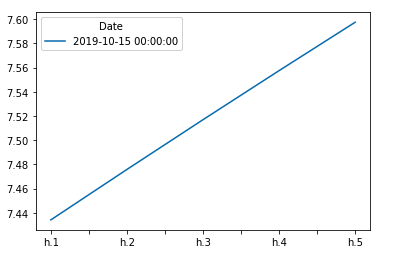

### Time-Series Forecasting

Yen Futures Data: 
1. Read in csv data
2. use .loc to pull date labels from 1990 to the future.
3. Plot 'Settle' column data to see plot of Yen against USD over time. 

4. Hodrick-Prescott Filter to separate 'Settle' into trend and noise to better determine the relationship between Yen and USD. Trend reveals ST opportunity for futures, and Noise allows you to see outlying data that deviates from the trend lines. 

5. ARMA Model again using 'Settle' data. Calculate .pct_change and multiply by 100 to get the change in percent returns. Drop nan values and replace inf with np.nan for proper removal. Fit the data using order=(2,1) and pull summary results. Plot the 5 day forecast for better visualization. 
1[ARMA_5](./images/arma_5.png)
6. ARIMA Model using 'Settle' data, fit the data using order=(5,1,1). Pull summary results and plot the 5 day forecast for better visualization. 

7. GARCH Volatilty Forecasting, fit the model using order (2,1) and summarize results. Set a variable for the 'last_day' of the dataset and use that to create a 5 day forecast. Transpose the forecast and plot for better visualization. 

##### In all models from Time-Series Forecasting we saw an uptick in Yen. Given all models showed a rising value I would feel confident in using the model to trade. 

### Regression Analysis 

Yen Futures Data: 
1. Read in csv data
2. use .loc to pull date labels from 1990 to the future. 
3. Calculate .pct_change in settle values and drop nans. 
4. Calculate lagged returns by shifting the settle return data once. 
5. Split the data so before 2018 is the training data, and post 2018 is the testing data. 
6. Denote X and Y training and testing data, while putting X train and test data into respective DataFrames. 
7. Declare a linear regression model and fit data. 
8. Make predictions for y values. 
9. Put y test values into a dataframe then add the predictions. 
10. Plot the first 20 predictions vs. true values and compare. 

11. Calculate in and out of sample performance for MSE and RMSE. 
    Out-of-Sample: 
        Mean Square Error (MSE): 0.1724049501748365
        Root Mean Squared Error (RMSE): 0.41521675083603804
    In-Sample: 
        In-sample Mean Squared Error (MSE): 0.320209767675256
        In-sample Root Mean Squared Error (RMSE): 0.5658708047560468

## Conclusion

Although RMSE validity varies depending on scale of numbers used, in this model RMSE is higher for in-sample data and lower for. out-of-sample data. This implies that the out-of-sample data is more accurate than the in-sample data. Off by just over 0.10, additional data points could very easily switch the RMSE.

MSE is lower for the in-sample data and higher for the out-of-sample data. This implies that there is less variance from the in-sample data. Having more variance in the out-of-sample data could potentially lead to a higher MSE for in-sample data as time goes on.